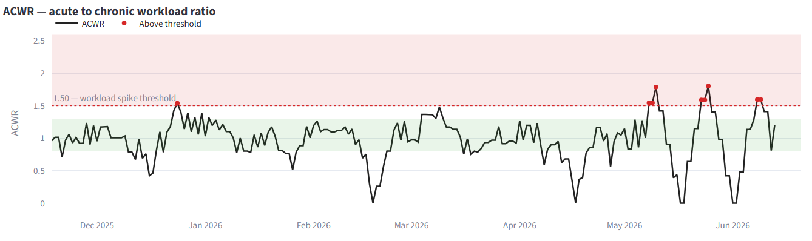
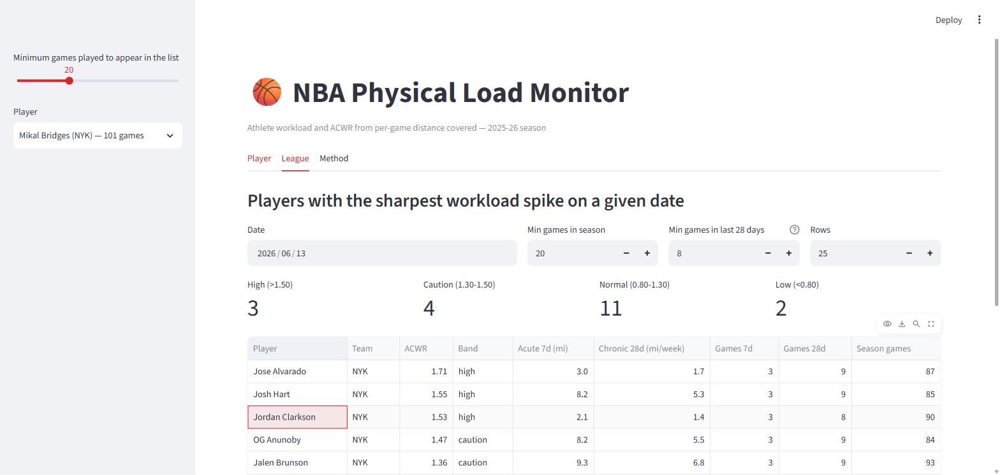

# NBA Physical Load Monitor

[](https://nba-load-monitor.streamlit.app/)

**Live app → [nba-load-monitor.streamlit.app](https://nba-load-monitor.streamlit.app/)**

Tracking athlete workload from NBA public player-tracking data, and flagging when a
player's recent load has spiked against their own recent baseline.

Built with Python, DuckDB, and Streamlit. **1,315 games · 591 players · 34,587
player-game rows** from the 2025-26 season, regular season and playoffs.



*One player's season. The dips to zero are the All-Star break and the gap before the
playoffs; the three red markers in May and June are workload spikes during playoff
series.*

---

## The question

Sports science has a standard way of asking whether an athlete is ramping up too fast:
the **Acute:Chronic Workload Ratio**. Compare the last week of work against the last
month of it. A player doing far more this week than their body has recently adapted to
is in the zone associated with elevated injury risk.

The inputs are usually GPS vests and private club data. The NBA publishes something
close enough to try it in the open: **distance covered and average speed, per player,
per game.**

So: *when does a player's physical load leave the safe range, and what in the schedule
put it there?*

This is deliberately not a box-score dashboard. Nothing here is about points or
efficiency — it sits entirely on the physical side.

## The data

| | |
|---|---|
| Source | NBA public player tracking (`nba_api`) |
| Season | 2025-26, complete |
| Games | 1,230 regular season + 85 playoff = **1,315** |
| Rows | 34,587 player-game observations, 591 players |
| Per game | 1.65 miles and 4.32 mph on average, per player who took the floor |
| Schedule | 15.6% of appearances came on zero days' rest (back-to-backs) |

Fetching the season takes about 22 minutes at a rate limit the API tolerates. The
ingest is **idempotent** — the presence of a file is the ledger, so an interrupted run
picks up exactly where it stopped. The full season fetched with **zero failed games**.

## How ACWR is computed here

| | |
|---|---|
| **Load** | distance covered in a game, in miles |
| **Acute** | total load over the last 7 days |
| **Chronic** | total load over the last 28 days ÷ 4 (a weekly average) |
| **ACWR** | acute ÷ chronic |

Four decisions do most of the work, and each one is a place this metric is commonly
gotten wrong:

**A day without a game carries load 0 — the row is not skipped.** The series is daily
and gap-free. This is what lets rest genuinely pull chronic load down, so the spike on
return actually appears. Listing only game days would make four games in four days and
four games in twenty days look identical, which defeats the entire point.

**The calendar starts at each player's own first game**, not at the start of the season.
Back-filling zeros to opening night for someone who arrived in February would depress
their chronic load and inflate their ratio for no physical reason.

**No ratio is published during the first 28 days.** Dividing by a half-filled chronic
window hands every player a fake 2-3 in their opening weeks — the quiet way this kind
of dashboard becomes unreadable.

**ACWR has a hard ceiling of 4.0.** The acute window is a subset of the chronic one, and
the chronic sum is divided by four, so a player with a single game in the last 28 days
lands on exactly 4.0 by construction. That is an absent baseline, not a spike. The
league table filters on how full the chronic window actually is; without that filter it
fills up with players returning from absence rather than players under real load.

Across the season, 17.7% of computed player-days sit above the 1.50 threshold.

## What the app shows

**Player tab** — daily load with acute and chronic trends, the ACWR series against its
interpretation bands, distance per game with back-to-backs called out, and the full
game log with rest days.

**League tab** — on any date, who is carrying the sharpest spike, with the chronic
window fill shown so the number can be judged rather than just read.

**Method tab** — the reasoning above, in the app, next to the numbers it explains.



## Architecture

```
src/ingest.py     nba_api -> data/raw/{game_id}.parquet -> curated layer
sql/*.sql         all load, ACWR and rest-day logic
src/db.py         runs the SQL; contains no arithmetic of its own
app.py            asks and draws; contains no arithmetic of its own
tests/            executes the .sql files against synthetic schedules
```

**The metrics live in SQL, not in pandas.** `src/db.py` and `app.py` between them
contain zero metric arithmetic — they load `.sql` files and hand back DataFrames. The
window functions in [`sql/30_acwr.sql`](sql/30_acwr.sql) are the actual implementation.

**Two data layers.** `data/raw/` holds one Parquet per game and stays out of git.
`data/curated/` holds the consolidated, column-selected, minutes-parsed layer — 34,587
rows in 0.26 MB — and is committed, because Streamlit Community Cloud runs the app
straight from the repository. Raw data still never enters git; what ships is derived.

**One place defines where data lives.** `src/config.py::DATA_DIR` is read by ingest,
DuckDB and the app alike. DuckDB reads a local path and an `s3://` URI through the same
`read_parquet()` call, so moving the layer to object storage is a configuration change
rather than a rewrite.

## Tests

```
pytest -q     # 41 passed
```

The tests do **not** exercise a Python re-implementation of ACWR. They read the `.sql`
files off disk and execute them against synthetic schedules in an in-memory DuckDB, so
the SQL under test is byte-for-byte the SQL the app runs — a parallel implementation
could drift apart in silence.

The schedules are built so the expected answer is arithmetic rather than an estimate.
Any 7 consecutive days contain each weekday exactly once, so a fixed Mon/Wed/Fri rhythm
puts 3 games in every acute window and 12 in every chronic one, pinning ACWR to exactly
1.0. Against that baseline the suite checks the warm-up window, the zero-chronic guard,
the 4.0 ceiling, sudden congestion, return from a long absence, back-to-back detection,
and that DNP rows stay in the series as zeros without being counted as games played.

That last one was a real bug found by looking at real output: DNP rows were inflating the
chronic-window game count, which made the league table's noise filter pass exactly the
players it exists to reject.

## Running it

```bash
python -m venv .venv && source .venv/Scripts/activate
pip install -r requirements.txt

python -m src.ingest --season 2025-26   # ~22 min, resumable
python -m src.db --check                # smoke test the SQL layer
pytest                                  # 41 tests
streamlit run app.py
```

## Limitations

The public feed gives **total** distance and **mean** speed per game. There is no
acceleration, no change of direction, and no high-speed running distance — largely the
things that make load models physiologically meaningful. Average speed is therefore
reported alongside load rather than folded into it; multiplying volume by mean speed
would invent a score that cannot be defended.

**Training load is entirely absent.** These are games only, a fraction of an athlete's
true workload.

ACWR is a monitoring tool, not an injury prediction, and the evidence base behind the
specific thresholds is contested in the literature.
